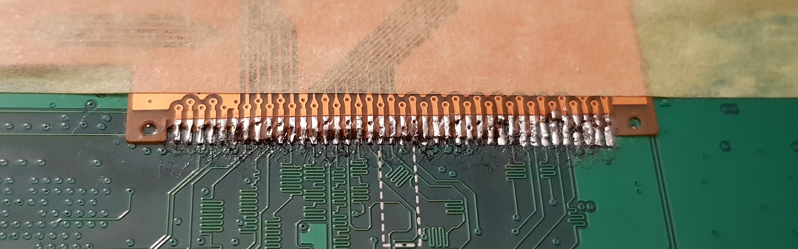

# BrauEule
Dies dient als Sammlung von Anleitungen in Wartund und Pflege rund um die [Brumas BrauEule III](https://www.brumas.com/brumas/). Ihr handelt eigenverantwortlich, ich übernehme keine Verantwortung für Garantieverlust oder etwaige Schäden.

## Austasch Touchscreen (unfertiger Entwurf)
### Vorweg 
Beim letzen Brauvorgang habe ich beim Starten der BrauEule gemerkt, dass der Touchscreen nicht mehr reagiert. Mir fiel schon vorher ein Riss durch den Screen auf, ich hoffte aber immer, es betrifft nur das Schutzglas. Nach Konktakt zum Hersteller beschloss ich erstmal die Reperatur selber zu versuchen und schraubte die BrauEule auf. Daraus ist diese kleine Anleitung entstanden.

### Werkzeug
Ihr benötigt folgendes Werkzeug
- Torx-Schraubendreher
- Lötstation + Equipment (hohe Präzision erforderlich)
- Scharfes Messer mit flacher Klinge
- Heißluftpistole

### Ersatzeile
Nach meiner Recherche ist das Display (Rocktech Displays RK043FN48H-CT) nicht einzeln zu haben, daher habe ich ein baugleiches Ersatzboard für etwa 45€ im Neuzustand ersteigert. Ihr könnt nicht einfach das neue Board verbauen, da auf diesem natürlich nicht die notwendige Software vorhanden ist und auch das Shield von Brumas fehlt.

Beim verwendeten Board handelt es sich um ein [STM32F7 des Herstellers ST](https://www.st.com/en/microcontrollers-microprocessors/stm32f7-series.html). 

### Öffnen der BrauEule
Vorher unbedingt den Strom abschalten, am besten den Stecker ziehen und sicherstellen, dass keine Restspannung vorhanden ist. Zum Öffnen der BrauEule müssen die Schrauben des Metallgehäuses mit einem Torx-Schraubendreher gelöst werden. Anschließend kann man das Gehäuse vorsichtig nach hinten wegklappen. Achtet hier darauf keine Kabel oder andere Bauteile zu beschädigen.

### Ausbau des Boards mit Touchscreen
Die Platine ist direkt hinter dem Touchscreen im vorderen Teil der BrauEule zu finden. Es ist mit vier Schrauben am Gehäuse befestigt, diese können von innen gelöst werden. Passt beim Abschrauben auf, dass ihr nicht die Abstandshalter verliert und sammelt diese zusammen mit den Schrauben in einer Schale oder ähnlichem.

Bevor ihr das Board entnehmen könnt, müssen vier Stecker gelöst werden. Als erstes solltet ihr den zweipoligen Stecker (+5V, GND) zur Spannungsversorgung lösen - im Bild rechts unten. Anschließend könnt ihr einfach die beiden breiten Stecker abziehen. Der letzte Anschluss, vom Lautsprecher, ist verlötet. Diesen müsst ihr entweder entlöten (saubere Lösung), oder das Kabel mit etwas Spielraum kappen, um es später wieder verbinden zu können (nicht so schön). Jetzt könnt ihr das Board entnehmen.

### Trennen des Touchscreens
Der Touchscreen ist von Haus aus verbaut und leider mit drei bis vier Klebestreifen auf dem Board befestigt. Um diese zu lösen, kann man von der Seite mit einer scharfen Klinge die Klebestreifen durchtrennen. Achtet drauf, dass ihr nichts beschädigt oder zerkratzt. Es muss nur an 3 von 4 Seiten durchtrennt werden. An der Seite mit den Flachkabeln (im Bild oben) verlief bei mir kein Klebestreifen. Seid ihr euch sicher, dass ihr alle Streifen durchgeschnitten habt, könnt ihr den Touchscreen mit Vorsicht aber etwas Kraft nach vorne wegklappen.

Anschließend könnt ihr die Lötellen lösen. Das klingt einfacher als es ist. Die Verbindungen sind sehr fein und mit einer normales Lötpumpe wohl nur schwer umzusetzen. Ich hatte das Glück, dass mir ein Freund ausgeholfen hat. Er verfügt über ein gut ausgerüstetes Lötlabor und konnte es mit Flussmittel, Heißluftdüse und einer Lötpumpe sauber trennen.

Sofern ihr das Ersatzdisplay nicht einzeln bekommen habt, müsst ihr dieses auf gleichem Wege von der *Spenderplatine* lösen.

### Auflöten des neuen Display
Auch hier ist wieder hohe Präzision erfolderlich. Das funktionierende Display muss auf die Platine gelötet werden, die der BrauEule entnommen wurde. 

